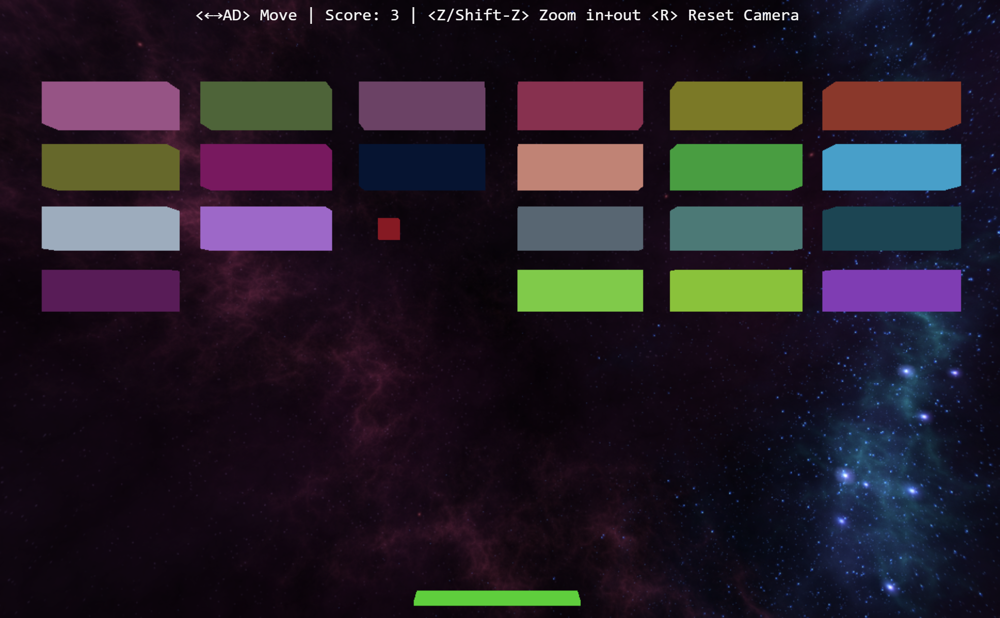

# Arkaclone: Infinite Break The Bricks

A clone of the classic game Arkanoid with an infinite spin thrown
into the mix. I wanted to build something fun with [threejs](https://threejs.org/). So here it is! It took me about a week to build and I
had a ton of fun. As threejs is only a renderer, building a game with it
felt like creating a small engine of sorts. There is so much more
I could have done here and may improve this in the future. For now,
I will leave it at this.

🎮Play: https://arkaclone.vercel.app/

# Description and Screenshot
Its a game like Arkanoid or Break The Bricks that is never ending.
It just keeps generating more bricks after every wave.

# License
This game/software is licensed under the MIT license.
See [LICENSE](LICENSE) for details.